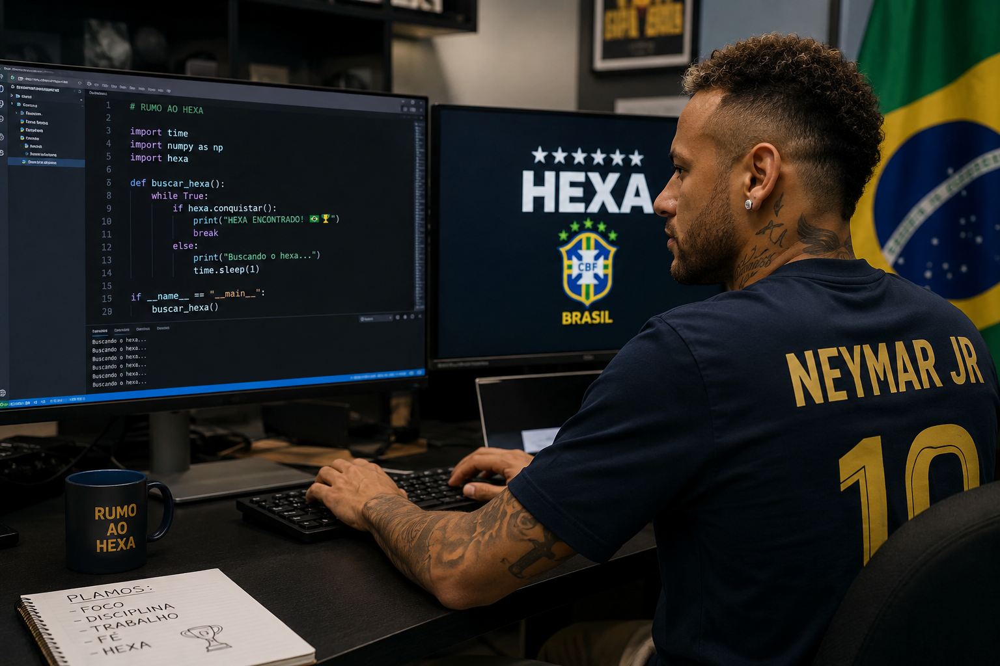

# Olá, eu sou [Victor Gustavo] 👋

Sou estudante de programação com foco em Python e estou aprendendo desenvolvimento de software, lógica de programação e automação. Gosto de aprender novas tecnologias e desenvolver projetos para praticar meus conhecimentos. 

---

## 🚀 Sobre mim

Atualmente faço curso de programação em Python e estou desenvolvendo minhas habilidades na área da tecnologia. Comecei estudando lógica de programação e hoje pratico criando pequenos projetos, automações e exercícios para melhorar meu aprendizado.

---

# 🛠️ Hard Skills

# Programação

- Python
- Lógica de Programação
- Automação de tarefas
- Manipulação de dados
- Sistemas e Ferramentas
- SAP
- Microsoft Excel
- Microsoft PowerPoint
- Microsoft Word
- VS Code
- Git e GitHub

# Conhecimentos

- Organização e análise de dados
- Criação de relatórios
- Desenvolvimento de automações simples
- Estruturas condicionais e de repetição
- Banco de dados básico
- APIs básicas

## Linguagens
- Python

---

# 🌟 Soft Skills

- Vontade de aprender
- Trabalho em equipe
- Organização
- Comunicação
- Proatividade
- Facilidade em aprender novas tecnologias

---

# 📈 Objetivos

Meu objetivo é crescer na área da programação, adquirir experiência profissional e me tornar um desenvolvedor Python qualificado. Também tenho interesse em seguir carreira como Engenheiro de Automação, trabalhando com sistemas inteligentes, automações e desenvolvimento de soluções tecnológicas para otimizar processos.

---

# 📫 Contato

- GitHub: github.com/seuusuario
- Email: victor.gustavo1982@gmail.com

---

⭐ Sempre aberto a novos desafios e oportunidades de crescimento.
